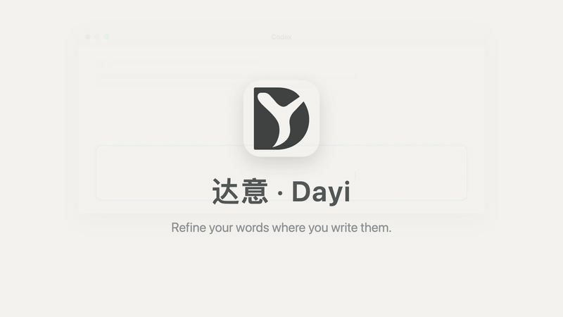

<p align="center">
  <picture>
    <source media="(prefers-color-scheme: dark)" srcset="Assets/Dayi-reverse.svg">
    
  </picture>
</p>

<h1 align="center">Dayi · 达意</h1>
<p align="center">Polish the text you're typing, where you're typing it.</p>
<p align="center"><a href="README.zh-CN.md">简体中文</a> · English</p>
<p align="center">
  <a href="https://github.com/reny1cao/dayi/releases/latest"></a>
  
  
  <a href="LICENSE"></a>
</p>

<p align="center"></p>

Select a rough draft in Codex, Claude, or any macOS text input, press **⌃⌥P**, and it is rewritten in place by a model you choose. **⌃⌥Z** undoes only that replacement. Dayi never sends your draft for you.

- **Bring your own model.** Any Chat Completions-compatible endpoint, including local ones. Keys live in your Keychain.
- **No account, no server.** History stays in a local SQLite file. The only network request is the one you configured.
- **Undo you can trust.** Dayi reads the field back after writing and refuses to overwrite text that changed under it.
- **Open source.** MIT, [notarized builds on GitHub Releases](https://github.com/reny1cao/dayi/releases/latest), a Homebrew cask once the repository qualifies.

**Install:** download the latest `Dayi-*.zip` from [Releases](https://github.com/reny1cao/dayi/releases/latest), verify `SHA256SUMS.txt`, move `Dayi.app` to `/Applications`, then grant Accessibility access when asked. Apple Silicon, macOS 14 or later. Current preview: `v0.2.4-preview.2`; open acceptance items are in the [release readiness report](docs/releases/readiness.md).

## What leaves your Mac

| Data | Where it goes | When |
|---|---|---|
| The selected or captured text, plus the bundled or your custom prompt | The model endpoint you configured, over HTTPS | Only when you press ⌃⌥P |
| Your API key | macOS Keychain; sent only as the `Authorization` header to that endpoint | Same request |
| A website hostname (e.g. `github.com`) | Nowhere; stored locally for history filters | On capture from a browser |
| A missing site icon request | The site's public HTTPS origin, without cookies or the page URL | Once per host, cached |
| An update check | `https://reny1cao.github.io/dayi/appcast.xml`, a static file on GitHub Pages, via Sparkle with system profiling off | Once a day if you allow automatic checks, or when you choose Check for Updates |
| Anything else (drafts, results, history, usage) | Nowhere. Dayi has no telemetry | — |

Accessibility permission lets Dayi read the focused text field and write the result back. It does not read other windows or run when you are not pressing the shortcut. For web and Electron editors it pastes through the clipboard and restores your previous clipboard contents right after; it never monitors the clipboard. The source for every line above is in [Sources/](Sources/).

## Demo

https://github.com/user-attachments/assets/a05d6635-e27f-481c-8394-49a98d746444

42 seconds, no audio: polish in place, undo, the pending-result flow for web inputs, and the activity window. [中文视频](https://github.com/user-attachments/assets/8c2572ea-6116-45b0-b5b5-97b47129624e) · [download](https://github.com/reny1cao/dayi/releases/download/v0.2.4-preview.1/dayi-demo-en.mp4). The videos use synthetic drafts and a generic assistant window, not recordings of real sessions.

## What works today

- Native activity table with search, filters, history, and an inspector.
- Browser website attribution, domain filters, and automatic missing-site icons. Icons load asynchronously and persist in a local cache.
- Multiple saved model profiles, custom Chat Completions-compatible providers, model-list discovery, and manual model IDs. Listing a model does not prove inference compatibility.
- Chinese and English interfaces; language changes take effect at the next launch.
- Preview and edit system/user prompts in **Settings → Prompt**, save a local override, or restore the bundled default. Preview is local and does not call the model.
- Configurable global shortcuts and explicit confirmation when assigning ⌘X, which conflicts with Cut.
- Target-bound edits, read-back verification, and conflict-aware undo for the current session.

The default prompt is written for Dayi to clarify drafts while preserving their meaning, language, and constraints. Requests remain requests rather than being answered. See [default prompt behavior](docs/default-prompt.md). Light/medium/deep rewriting controls remain under review; they are not shipped capabilities.

## Requirements

| | Current support |
|---|---|
| Preview binary | Apple Silicon (`arm64`) only |
| Declared deployment target | macOS 14 or later |
| Locally exercised system | macOS 26; minimum-version and Intel acceptance remain pending |
| Building from source | Xcode with Swift 6.3 or later; validated with Apple Swift 6.3.3 (CI, Xcode 26.6) and 6.4 (local, Xcode 27.0) |
| Model access | Your own provider/API key; requests may incur provider charges |
| Permission | macOS Accessibility access for the installed Dayi app |

## Getting started

Public downloads will appear on GitHub Releases after the release gates are cleared. For an authorized preview build:

1. Verify its `SHA256SUMS.txt`, unzip `Dayi.app`, and put it in `/Applications`.
2. Open Dayi and allow it under **System Settings → Privacy & Security → Accessibility**.
3. Open Dayi settings, choose or add a provider, enter your API key, and save the profile. Fetch the model list when supported, or enter a model ID manually.
4. Focus a supported text input and press **⌃⌥P**. A nonempty selection is used; with no selection, Dayi attempts to capture the entire input.
5. Review the status. A result waiting for foreground access is kept until you return to its original input and apply it.

Default undo is **⌃⌥Z**. Existing saved shortcuts are preserved. New users do not get ⌘X by default. Dayi never submits the target draft automatically.

To customize polishing, open **Settings → Prompt**. Keep exactly one `{input}` in the user prompt, preview it with a sample draft, then choose **Save and Activate**. Changes apply to the next request and survive restart; running requests retain their original prompt. **Restore default content** fills the editor with the shipped template; save to apply it. Local edits are stored in your private database and do not modify this repository's default.

Do not disable Gatekeeper globally to install a preview. The public release should be Developer ID signed, notarized, and stapled first.

## Compatibility and limits

Native text areas can support background replacement. **Web and Electron editors currently require the original target in the foreground**; keeping a job alive after focus changes is not background write-back.

Chrome and Safari source capture have been exercised; Chrome has completed a synthetic foreground polishing flow. Firefox, Edge, and Brave identities are recognized, but their full editing flows are not accepted yet. Chromium rich-text coordinate mapping is implemented and tested with synthetic cases; complex editors, embedded attachments, input-method composition, and real multi-paragraph Claude Code acceptance remain incomplete.

Undo lives in memory and disappears when Dayi exits. It refuses conflicting edits rather than overwriting new text. Downloaded icons may be unavailable for login-protected, private-network, SVG-only, or otherwise unsupported sites. See [browser source verification](docs/browser-source.md) and [website icons](docs/website-icons.md).

## Privacy and storage

The selected/captured text is sent to the provider you configure. Model credentials come from explicit local configuration or process environment; saved credentials use macOS Keychain. The app does not automatically read conversation history or attachments.

History is stored locally at `~/Library/Application Support/dev.local.dayi/dayi.sqlite3`, with a private directory/file mode (0700/0600). By default, records older than 30 days or beyond 500 entries are removed; stored text is cleared after 7 days. These retention settings are configurable. History after restart is view/copy only.

Website history stores a hostname, not a full page URL. Missing favicons are requested directly from public HTTPS sites without browser cookies, credentials, the original page URL, or draft text. The fetch may read the public homepage prefix to locate its icon declaration. Its local cache is under `~/Library/Caches/dev.local.dayi/website-icons/`; browsing history or scrolling the list does not trigger downloads.

See [persistence](docs/persistence.md), [third-party notices](THIRD_PARTY_NOTICES.md), and [security reporting](SECURITY.md).

## Build and test

```sh
swift test
zsh scripts/package-app.sh
```

The output is `outputs/Dayi.app`. The packaging script builds the supplied artwork into `.icns`, embeds localized resources, and signs with an available Developer ID certificate. Without one, local builds use ad-hoc signing; Accessibility permission may need to be granted again. Use `POLISH_SIGN_IDENTITY` to select a specific signing identity.

GRDB **7.11.1** and Sparkle **2.10.0**, both pinned exactly, are the only third-party Swift dependencies. Networking, HTML icon parsing, and image decoding use Apple frameworks. Shell scripts use macOS tools; Python scripts use the standard library only. The Swift package remains `TextPolish`; `PolishCore` and `PolishStore` are internal app modules, not separately distributed libraries.

Tests do not normally contact a model. Live model, browser, and icon checks are explicit opt-ins; unit tests and a successful build are not substitutes for real-client acceptance.

## Releases and contributions

GitHub Releases is the initial distribution channel. Its versioned assets, release notes, issues, and source references fit this small native project. The current cross-application Accessibility design is incompatible with the ordinary App Sandbox route required by the Mac App Store. Homebrew Cask and automatic updates are deferred until public, notarized releases are repeatable.

The planned preview artifacts are a signed app ZIP, checksums, and source commit/build metadata, attached to a GitHub draft release. Public publication remains a separate final step. See [release skills, platform analysis, and gates](docs/releases/readiness.md), [the release runbook](docs/releases/runbook.md), and [CONTRIBUTING](CONTRIBUTING.md).

## License status

Project-owned code is licensed under the [MIT License](LICENSE). The current default prompt was newly written for Dayi; the retired third-party template is excluded from the current app resources. This public repository starts from the release commit; the earlier private history contains retired material and is intentionally not published. Third-party notices and brand-asset rights remain release gates.

## 中文说明

完整中文文档见 [README.zh-CN.md](README.zh-CN.md)。
