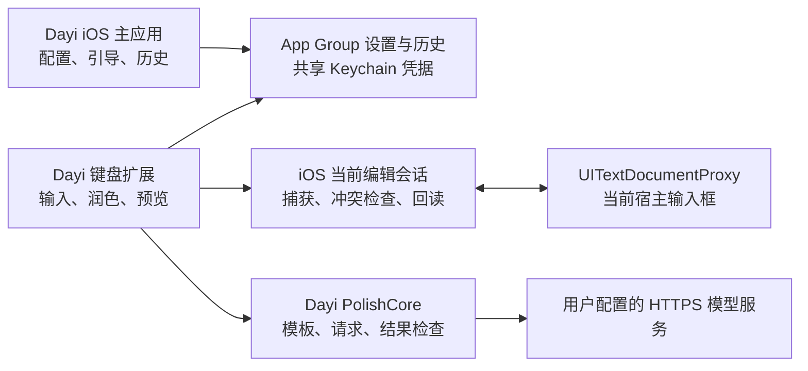

# ProseKey AI 与 Dayi iOS 键盘可行性调研

调研日期：2026-09-08。范围：源码审阅、Apple 官方接口及审核规则核对、替换决策模拟复现；不是 iPhone 真机验收。

## 结论

可以把 Dayi 的润色能力做成 iOS 第三方键盘。ProseKey AI 能提供主应用、键盘扩展和 AI 操作界面的参考；获得合适授权或接受 GPL 条件后，也能用作改造起点。但不能只改品牌、换提示词就作为 Dayi 发布。

有三个决定路线的事实：

1. ProseKey AI 使用 GPLv3。内部研究与对外发行是不同阶段；闭源发行不能直接套用当前许可证。
2. 它主要是 AI 工具面板，没有中文拼音引擎。源码中的 QWERTY 只编辑扩展内部的自定义指令，没有作为宿主输入框的常规打字键盘。
3. 它的原位替换没有 Dayi 所要求的目标绑定、冲突检查和写后核验，不能原样继承。

当前建议：先以“已有中文键盘输入 → 选中文字 → 切到 Dayi → 润色 → 预览 → 确认替换”为第一阶段假设，并保留基础离线字符输入与切换键。若产品要求 Dayi 自带拼音、成为日常主键盘，应把中文输入引擎作为独立选型，不能视作 ProseKey 的小改动。

## 已核实的基线

| 对象 | 当前证据 |
| --- | --- |
| Dayi | 本地分支 `add-persistence-on-grdb`，HEAD `26350abd0242c26dd429e42ef2a7276d52faacdd`；调研前工作树干净 |
| ProseKey | [Aryamirsepasi/ProseKeyAI](https://github.com/Aryamirsepasi/ProseKeyAI)，main `6c8fafa46a41251c38bf6828f362f39365e4c36c` |
| 维护情况 | 最近 main 提交为 2026-03-01；查询时 35 stars、4 forks、未归档。不能据此认定已有充分维护与稳定性保障 |
| 发行情况 | [App Store](https://apps.apple.com/us/app/prosekey-ai/id6741180175) 显示 3.0，最低 iOS 16；商店存在不代表我们的衍生版本可直接通过审核 |
| 技术结构 | Swift、UIKit `UIInputViewController`、SwiftUI，主应用与键盘扩展两个产品目标；项目另有测试目标 |
| 依赖锁定 | AIProxySwift 0.140.0、swift-markdown-ui 2.4.1、OnboardingKit 8.1.0；另有 NetworkImage、swift-cmark 传递依赖 |

ProseKey 的 README 与实际代码存在时间差，例如 README 仍把 iPad 支持列作未来事项，而代码和商店已声明支持；因此以下判断以固定提交源码为主。Dayi README 中“没有第三方依赖”也已落后于 Package.swift 的 GRDB 7.11.1，本次未顺带修改。

## ProseKey 可以怎样利用

以下代码复用均以满足许可证为前提；若选择独立实现，则只参考产品行为和 Apple 公共接口，不复制 GPL 实现。

| 部分 | 现状 | Dayi 改造方式 |
| --- | --- | --- |
| 主应用与扩展结构 | 主应用配置模型、管理命令；扩展提供 AI 工具 | 复用结构，换成 Dayi 引导、配置和润色入口 |
| 键盘容器 | UIKit 承载 SwiftUI，控制高度、地球键与权限提示 | 可作为起点；验证横屏、iPad、动态字体和无完整访问时的行为 |
| 命令系统 | 自定义命令与预设改写功能 | 内部概念验证可先用自定义命令验证交互；正式版本调用 Dayi 核心，不维护两套润色逻辑 |
| 模型请求 | 多 provider，OpenAI 路径使用 AIProxy 的 direct service | 第一期沿用 Dayi HTTPS Chat Completions 契约；不必同时引入多 provider SDK |
| 凭据 | Keychain，通过共享 access group 供扩展访问 | 用我们自己的开发团队与共享组重新配置，真机验证读写；不沿用作者标识 |
| 剪贴板历史 | App Group UserDefaults 保存 JSON，显式点击时读取剪贴板 | 不直接当作 Dayi 润色历史；沿用 Dayi 的历史保留与失败提示要求 |
| 原位替换 | 当前选区插入，或移动光标搜索删除，再失败则插入 | 必须重做为可拒绝、可核验的当前编辑会话写入流程 |
| 常规输入 | QWERTY 编辑的是内部指令 Binding | 要作为日常输入键盘，需接入宿主 textDocumentProxy；中文另需输入引擎 |

源码入口：[KeyboardViewController](https://github.com/Aryamirsepasi/ProseKeyAI/blob/6c8fafa46a41251c38bf6828f362f39365e4c36c/WritingToolsKeyboard/WritingToolsKeyboardExt/Controller/KeyboardViewController.swift)、[AIToolsView](https://github.com/Aryamirsepasi/ProseKeyAI/blob/6c8fafa46a41251c38bf6828f362f39365e4c36c/WritingToolsKeyboard/WritingToolsKeyboardExt/Views/AIToolsView.swift)、[内部指令键盘适配器](https://github.com/Aryamirsepasi/ProseKeyAI/blob/6c8fafa46a41251c38bf6828f362f39365e4c36c/WritingToolsKeyboard/WritingToolsKeyboardExt/Views/CustomInstructionKeyboardRepresentable.swift)。

## 不能继承的写入行为

审阅 [TextReplacementEngine.swift](https://github.com/Aryamirsepasi/ProseKeyAI/blob/6c8fafa46a41251c38bf6828f362f39365e4c36c/WritingToolsKeyboard/WritingToolsKeyboardExt/Utilities/TextReplacementEngine.swift) 与调用者后确认：

- `.selection` 分支只检查当前选区非空，没有比较它是否等于请求时原文，也没有绑定 `documentIdentifier`。
- 选区消失后改走搜索；搜索失败继续 `insertText`。这会把“不能确认替换位置”变成“往当前光标插入”。
- 搜索实现把移动光标后的 `documentContextBeforeInput` 当作全文，倒序匹配原文，再循环删除。公共接口没有保证这里返回全文，重复内容也可能命中另一处。
- 搜索过程中可能先移动光标再失败，未恢复原位置；执行插入后没有回读证明，UI 仍清掉结果并给成功反馈。
- AI 输入超过 8000 字符会静默截断，但替换仍使用原先捕获的文本；长选区可能用只处理前半段的结果覆盖整个选区。
- 生成任务绑定视图，`onDisappear` 取消，不能直接对应 Dayi 常驻 macOS 宿主的任务生命周期。

用上游决策函数原样执行了两个合成案例，仅去掉 UIKit 适配器、用 mock proxy 记录写调用：

```text
changed_selection: replacedSelection, insert_calls=1
missing_selection_and_search_failure: insertedAtCursorFallback, insert_calls=1
```

这证明两个不安全分支确实存在，不证明任一 iOS 客户端发生过实际误写。临时源码快照及 harness 位于 `/tmp/dayi-prosekey-research-20260908`，未复制到本仓库。

## Dayi 核心复用与 iOS 边界

| Dayi 部件 | 判断 | 需要的工作 |
| --- | --- | --- |
| `Polisher` | 主要是 Foundation/URLSession，可作为共享核心候选 | iOS 编译与真实模型验证；保留 HTTPS、禁止重定向、拒绝空/截断结果、不暴露响应正文的保护 |
| `ModelConfiguration` | 可复用显式构造入口 | iOS 从用户在主应用配置的设置和 Keychain 注入，不使用 macOS 环境变量/WorkBuddy 本机文件 |
| `PromptTemplate` | 渲染与字面保真逻辑可复用 | 验证 app 与 appex 中 SPM 资源定位；现有 `.app` 手工 bundle 路径不能假定适用于 iOS |
| `PolishJobs` / `TextTarget` | 不能直接套在键盘 proxy 上 | 现有契约依赖全文、稳定范围和目标句柄；为 iOS 当前会话设计小型协调逻辑，不伪造全文来满足接口 |
| `PolishStore` / GRDB | 实体、仓储和保留策略可作为复用候选 | App Group 内数据库位置、跨进程访问、数据保护、WAL 文件、扩展资源消耗与失败降级需验证 |
| AX、Carbon、CLI 文件操作 | 不属于 iOS 键盘入口 | 不移植到扩展；保持 macOS 目标独立 |

本地依据：[Package.swift](../Package.swift)、[Polisher.swift](../Sources/PolishCore/Polisher.swift)、[PromptTemplate.swift](../Sources/PolishCore/PromptTemplate.swift)、[TextTarget.swift](../Sources/PolishCore/TextTarget.swift)、[PolishJobs.swift](../Sources/PolishCore/PolishJobs.swift)、[持久化设计](persistence.md)。这些是源码判断，尚未证明整个 Swift 包可在 iOS 编译。

可以先评估以 iOS 17 为最低版本：Dayi 使用 Observation，避免为了照搬上游 iOS 16 最低版本而增加兼容层。最终最低版本需结合设备范围确定；不能用此建议冒充构建结论。

建议模块关系：



网络请求直接由有完整访问权限的键盘扩展发起。主应用不需要常驻后台；共享配置不等于主应用会替扩展持续执行任务。第一版可采用 BYOK，不新增账号、计费与后端。以后若提供我们付费的模型服务，服务密钥应留在服务端，不能装进键盘二进制。

## iOS 能做到与不能承诺的事

Apple 当前 `UITextDocumentProxy` 提供 `selectedText`、光标前后上下文、`documentIdentifier`、插入/删除及光标移动；它不等同于宿主的完整 `UITextInput`，不能把后者的任意范围 API 当作键盘已获得的能力。[官方接口](https://developer.apple.com/documentation/uikit/uitextdocumentproxy)

本机 Xcode SDK 的 `UIInputViewController.h` 也核实了 `selectedText` 和 `documentIdentifier` 从 iOS 11 可用。上游“iOS 16+ 才有选区 API”的注释不准确；商店“iOS 18+ 文本替换”也不能据此理解为键盘获得了全文事务 API。

推荐的安全交互：

1. 用户明确选择润色范围；只将该文本提交模型，不自动附带聊天历史、附件或其他上下文。
2. 保存请求时的文档标识、原选区与可见边界文本，并记录编辑会话变化。上下文用于本地冲突核验，不自动发送模型。
3. 生成结果先预览；用户确认时重新核对当前文档、选区和会话。相同文本及相同局部上下文不总能证明是原位置；遇到无法消除的歧义拒绝覆盖。
4. 在支持的宿主上替换仍有效的选区，写后用可获得的上下文核验。接口不提供数据库式原子比较交换，宿主竞争编辑仍须真机验证；不能证明结果则显示 uncertain 并保留原文/结果，不重写。
5. 撤回只支持同一有效会话内可证明的最近替换。若后续编辑或上下文不足以确认范围，拒绝覆盖；恢复原文只能作为用户显式选择的操作。
6. 无法获得选区时，提示选择原文，或让用户显式使用复制的文本并选择插入结果；不能悄悄从“替换”降级为“插入”。

这比 macOS U-07 的承诺弱：iOS 键盘不能保证切到另一 App 后仍后台运行、再写回旧 App。扩展可被系统回收，proxy 代表当前输入对象；保存结果也不等于后台回写完成。[扩展生命周期](https://developer.apple.com/library/archive/documentation/General/Conceptual/ExtensibilityPG/ExtensionOverview.html)

密码输入框、部分电话号码键盘和主动禁用第三方键盘的 App 不在通用覆盖范围。拼音组合、附件和富文本也必须单独测试，不能以普通 TextView 通过代替。[Apple 键盘边界](https://developer.apple.com/library/archive/documentation/General/Conceptual/ExtensibilityPG/CustomKeyboard.html)

## 许可证与发布路线

ProseKey 的 [LICENSE](https://github.com/Aryamirsepasi/ProseKeyAI/blob/6c8fafa46a41251c38bf6828f362f39365e4c36c/LICENSE) 是 GPLv3。按 GNU 官方说明，可以私下修改、自用；对外提供衍生程序时，需要按适用条款提供对应源码和权利。商业收费本身不是禁止项，但“收费”与“可闭源”是两回事。独立仓库或 Swift 包不会自动消除衍生作品的许可证要求。[GNU FAQ](https://www.gnu.org/licenses/gpl-faq.html.en#GPLRequireSourcePostedPublic)、[GPLv3 第 5、6、10 节](https://www.gnu.org/licenses/gpl-3.0.html)

| 路线 | 适用条件 | 建议 |
| --- | --- | --- |
| 内部原型直接改 ProseKey | 不对外分发，验证交互与技术可行性 | 最快验证；固定上游版本、保留版权信息，核心安全路径仍需重做 |
| 以 GPL 条件发行衍生版 | 接受对应源码与再分发要求 | 核验组合依赖、素材及 App Store 分发条款，不能仅以已上架为依据 |
| 获得另行授权 | 想复用代码并闭源发行 | 确认授权覆盖所有相关权利人及继承材料；不能假定维护者可重授权全部代码 |
| 用 Apple 框架独立实现 | 希望掌握许可证与产品范围 | 复用我们有权使用的 Dayi 代码，以 Apple 接口实现精简键盘；最适合长期闭源方向 |

FSF 曾说明 GPL 与 App Store 分发限制存在冲突。这是历史解释，不能直接代替对当前协议的逐项审阅，但足以说明“上游能下载”不是我们的授权结论。[FSF 说明](https://www.fsf.org/blogs/licensing/more-about-the-app-store-gpl-enforcement)

Dayi 还有一个独立的来源问题：现模板提取自 WorkBuddy 5.5.3，README 明确未给第三方材料添加开源许可证。它实际面向编程提示词增强，也不等于通用聊天润色。技术可以复用，不代表可直接把模板并入 GPL 衍生品或公开发布。正式产品需要核实授权，或在后续明确授权的提示词任务中编写与验证自有模板；本次不改原模板。（2026-09-15 补注：该模板已于 2026-09-11 由独立编写的 `dayi-default-1` 替换，见 docs/default-prompt.md；本段保留为当时的研究记录。）

Apple 审核 4.4.1 要求键盘提供字符输入、切到下一个键盘的方式，并在无网络/无完整访问时仍可用。因此“工具键盘”也应保留基础离线输入；联网润色可以明确提示需完整访问。4.3 也意味着单纯改名换图标不能作为上架策略。[审核指南](https://developer.apple.com/app-store/review/guidelines/)

新 iOS 产品需要自己的 app/appex 标识、App Group、签名配置、图标和隐私说明，保持既有 macOS Dayi 的 bundle ID 与路径不变。共享 Keychain 必须按我们实际签名后的 entitlement 验证，不仅替换字符串。[Apple Keychain 共享说明](https://developer.apple.com/documentation/xcode/configuring-keychain-sharing)

## 若要做完整中文主键盘

ProseKey 不能直接提供拼音切分、候选词、词频学习、组合态、词库和中文混输。这一层宜选现成引擎，再把 Dayi 放在上方工具栏，不自行从零编写拼音算法。

[librime](https://github.com/rime/librime) 是可进一步评估的输入引擎候选。[Hamster／仓输入法](https://github.com/imfuxiao/Hamster) 展示了 Rime 在 iOS 的落地，但 README 明确说商业化后续代码不再计划开源；虽声明 v2.1.0 起改 MIT，也列有不同许可证的第三方来源，不能据顶层 MIT 直接认定完整依赖链可随意闭源使用。它可以作为集成参考，本次未做该引擎路线的源码、依赖和维护审计，不把它标记为最终选型。

因此，工具键盘与完整中文主键盘是两种规模不同的交付；后者需额外验收词库授权、输入延迟、候选质量、内存峰值和隐私。

## 建议实施顺序与验收门槛

| 阶段 | 交付 | 通过条件 |
| --- | --- | --- |
| 1：技术探针 | 独立 iOS 主应用与键盘扩展，使用合成草稿 | 在 UITextView、Safari textarea、目标真实 App 中证明选区获取、替换、回读，以及切换输入框时拒绝误写 |
| 2：接 Dayi 核心 | 共享 Polisher、明确的模板与模型配置、预览/取消/替换 | iOS app 与 appex 资源可加载，真实模型返回正确，空/截断/超时结果不写入，取消后的迟到结果不应用 |
| 3：数据与恢复 | 共享凭据、按既有需求接历史、受限撤回 | 扩展与主应用可安全读写；存储失败不阻断润色；重启后历史只能查看/复制；没有跨会话撤回承诺 |
| 4：产品化 | 品牌、中文界面、基础输入与安装指引 | 无完整访问仍能输入和切换；真实设备横竖屏、长文、中文及 emoji 验证；许可证及分发路径明确 |
| 另案：完整拼音 | Rime 等引擎选型、候选栏与词库 | 输入质量、延迟、内存、组合态、依赖许可独立验收 |

关键反例必须覆盖：选区 A 生成中换成 B；同文档存在重复原文；切到新输入框/新 App；移动光标；超过 8000 字符；换行与 emoji ZWJ、组合重音；模型返回前继续输入；写后读不到正文；扩展被回收；撤回前发生编辑；断网/拒绝完整访问。选区切换跨键盘是否保留，也要按真实目标应用验证。

本次完成的是可行性调研和两个替换分支的模拟复现。未修改生产代码、提示词或配置，未创建 GitHub fork、提交、推送、安装 iPhone 应用，也未执行上游完整构建或真实模型/iOS 客户端验收。
